# audio-tools — Processing Pipeline (main branch)

This diagram details the end-to-end "session materials" pipeline as it runs on `master`, orchestrated by [`pipeline.py`](../pipeline.py). Each step runs in its own isolated Python virtual environment because their ML stacks conflict; `pipeline.py` wires them together, streams `PROGRESS` JSON for the web UI, and passes BPM / meter / downbeats between steps via a `.bpm` sidecar. See [`README.md`](../README.md) for usage and [`roadmap.md`](roadmap.md) for how it was built.

```mermaid
flowchart TD
    INP["🎵 Input audio<br/>wav · mp3 · m4a · flac · aiff · ogg"]:::io
    ORCH["⚙️ pipeline.py — orchestrator<br/>wires 3 isolated venvs · streams PROGRESS JSON<br/>passes BPM / meter / downbeats via .bpm sidecar"]:::orch
    INP --> ORCH

    ENTRY["Entry points<br/>• CLI — python3 pipeline.py -i song.wav<br/>• Web UI (web/) — spawns pipeline.py --progress-json<br/>• quick_analyze.py shows BPM/key/meter instantly on upload"]:::note
    ENTRY -.-> ORCH

    %% ── Step 1 ─────────────────────────────────────────────
    subgraph STEP1["STEP 1 · Beat Stabilization — beat_stabilizer.py · system Python"]
      direction TB
      A1["Detect beats + downbeats<br/>madmom RNN + DBN tracker, librosa fallback<br/>infer meter: 3/4 · 4/4 · 6/8"]:::proc
      A2["Tempo-change guard<br/>EARLY_STOP on multi-tempo songs<br/>override with --allow-tempo-change"]:::proc
      A3["Half-time auto-detect<br/>2× anchor density when tracker locks onto 8th notes"]:::proc
      A4["Time-warp every beat to a perfect grid (Rubber Band)<br/>+ intro trim: start 1 bar before beat 1 (DAW-ready)"]:::proc
      A1 --> A2 --> A3 --> A4
    end
    ORCH --> STEP1
    STEP1 --> O1["📤 *_stabilised.wav<br/>📤 *_stabilised.wav.bpm — BPM · meter · downbeats sidecar"]:::out

    %% ── Section detection (parallel, background) ────────────
    subgraph SEC["Section detection — run_allin1.py · venv_allin1 · runs in BACKGROUND"]
      direction TB
      C1["allin1 structural segmentation (runs Demucs internally)<br/>boundary detection + label clustering → A/B/C sections<br/>skipped with --skip-sections"]:::proc
    end
    O1 --> SEC

    %% ── Step 2 ─────────────────────────────────────────────
    subgraph STEP2["STEP 2 · Chord Chart — chord_chart_render.py + chord_sheet.py · venv_crema (+ venv_madmom)"]
      direction TB
      B1["HPSS pre-clean of the stabilised audio<br/>strip percussive (default) · optionally subtract drums stem"]:::proc
      B2["crema CNN chord detection — 602-class posteriors<br/>beat-synchronous alignment + bar quantization"]:::proc
      B3["madmom fallback re-evaluates low-confidence bars<br/>mean conf < 0.70 · on by default"]:::proc
      B4["Optional correction levers<br/>key-tiebreak · key-snap · bass-anchor · slash-chords<br/>section-consistency · key-aware Viterbi smoothing"]:::proc
      B5["Enharmonic spelling to the detected key<br/>render PDF (LilyPond) · MusicXML (music21) · PNG preview (PyMuPDF)"]:::proc
      B1 --> B2 --> B3 --> B4 --> B5
    end
    O1 --> STEP2
    SEC -. "*_sections.json — polled by the chord step" .-> STEP2
    STEP2 --> O2["📤 *_chord_chart.pdf<br/>📤 *_chord_chart.musicxml<br/>📤 *_chord_chart_preview.png<br/>📤 *_chord_chart.json — key · meter · sections · confidence"]:::out

    %% ── Step 3 ─────────────────────────────────────────────
    subgraph STEP3["STEP 3 · Stem Splitting — stem_splitter.py · venv_demucs"]
      direction TB
      D1["Demucs source separation<br/>htdemucs_6s → up to 6 stems"]:::proc
      D2["RMS presence detection per stem<br/>flag low-energy bleed vs real takes"]:::proc
      D3["Optional backing track (--session-type)<br/>mix all stems minus the chosen instrument · peak-normalised"]:::proc
      D1 --> D2 --> D3
    end
    O2 --> STEP3
    STEP3 --> O3["📤 *_stems/*.wav<br/>📤 *_stems/stems_info.json — present · rms_dbfs_peak · loud_seconds<br/>📤 *_backing_track.wav (when --session-type set)"]:::out

    O3 --> DONE["✅ All artifacts<br/>web UI bundles them into one ZIP download"]:::io

    %% ── Conditional reordering note ─────────────────────────
    REORDER["⚠️ 'stems-first' reordering<br/>when --bass-anchor / --slash-chords / --hpss-mode=hpss-no-drums are set,<br/>Stem Splitting runs BEFORE the chord step (it needs bass.wav / drums.wav).<br/>Default order shown: stabilize → chord → stems."]:::note
    REORDER -.-> STEP3

    classDef io fill:#1f2937,color:#ffffff,stroke:#111827,stroke-width:1px;
    classDef orch fill:#312e81,color:#ffffff,stroke:#1e1b4b,stroke-width:1px;
    classDef proc fill:#1e3a8a,color:#ffffff,stroke:#1e40af,stroke-width:1px;
    classDef out fill:#064e3b,color:#ffffff,stroke:#065f46,stroke-width:1px;
    classDef note fill:#78350f,color:#ffffff,stroke:#92400e,stroke-width:1px;
```

**Legend:** dark = entry / final bundle · indigo = orchestrator · blue = processing step · green = outputs written to `~/Desktop/audio-tools-tests/<song>/` (or the web job dir) · amber (dashed) = notes / conditional behaviour.

## Notes on flow

- **Skips.** `--skip-stabilize` feeds the input straight to the chord/stems steps; `--skip-stems` and `--skip-sections` drop those steps. `pipeline.py` redistributes the progress bar across whatever steps remain.
- **Parallelism.** Section detection (allin1) is launched as a background process alongside the chord step. allin1 internally runs Demucs (~3–5 min on CPU), so running it in parallel with crema + madmom (~5–8 min) hides its cost; the chord step polls for `*_sections.json` and waits up to 600 s if needed.
- **Stems-first reordering.** `--bass-anchor`, `--slash-chords`, and `--hpss-mode=hpss-no-drums` need `bass.wav` / `drums.wav` *before* chord detection, so stems run early in that case. Combining any of them with `--skip-stems` is a hard error.
- **Data hand-off.** The stabilizer writes a `.bpm` sidecar (BPM + meter + downbeats) next to the stabilised WAV; the chord step reads it automatically, so BPM never has to be passed twice.
